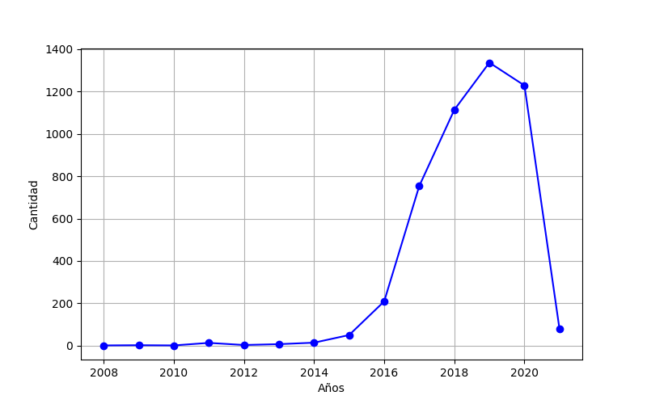
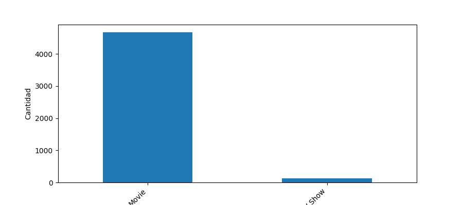
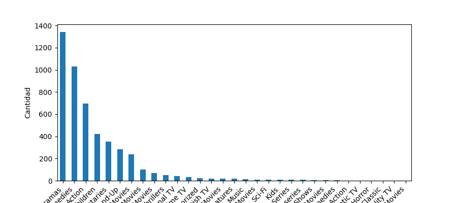

# Análisis de datos sobre un DataFrame de Netflix
## Período 2008 - 2021

### Introducción
Este pequeño análisis de datos muestra la situación temporal de la compañía americana de películas y series Netflix.\ A través de la extracción, limpieza y, posterior análisis y visualización, obtenemos información y conclusiones sobre la cantidad de elementos visuales que Netflix ha adquirido, así como los tipos y los géneros de los mismos.\ Comenzaremos con un gráfico lineal sobre la cantidad de adquisiciones que hizo la plataforma durante el período 2008 – 2021.\ En segundo lugar, facilitamos un gráfico de barras que muestra los tipos de elementos visuales que adquirió Netflix en el período establecido.\ Finalizamos el informe con un tercer gráfico de barras con los diferentes géneros que añadió la plataforma en los trece años analizados.\

### Resumen
**_OFERTA VISUAL_**
- Durante 2008, hasta 2015. Netlix mantuvo una tibia y constante adquisición de oferta visual. Apenas añadían más de 20 peliculas y series, hasta 2016, donde subieron a 200 adquisiciones.
- 2016 fue un año clave para la compañía, el aumento de inscripciones hizo que su oferta visual aumentara enormemente durante tres años, con un máximo de, casi 1400, compras en 2019. 
- La pandemia provocó un parón de producciones e hizo que la oferta descendiera vertiginosamente hasta cifras anteriores a 2016.\

\

**_TIPO DE OFERTA VISUAL_**
- La diferencia de oferta que adquiere Netflix es abismal. Sobran las palabras para ver que su núcleo de oferta visual son las películas, en comparación con las series/shows televisivos. 
- Netflix ofrece, durante la etapa 2008 hasta 2021, números superiores a las 4000 películas, en cambio, las series y shows de televisión no llegan ni a las 500 adquisiciones.\

\

**_GENERO VISUAL_**
- En este segundo gráfico se ve, nuevamente, como Netflix aumenta su oferta visual a través de adquirir mayormente películas. - De entre ellas, la mayor cantidad son de género “Drama”, seguida de “Comedia” y “Acción”. 
- De entre todo el género, el núcleo de la oferta sería entre “Drama” y “Terror”. A partir de ahí, la oferta del resto de géneros es prácticamente inapreciable.\

\

### Conclusiones
Aunque Netflix nació en 1997, no comenzó a despegar hasta 2015, como demuestra el primer gráfico de dicho informe, siendo 2019 su mejor año.\
Después del 2019, la pandemia de la COVID – 19 fue clave en el fuerte descenso de adquisiciones. Al no haber producciones audiovisuales, debido al previo confinamiento, la oferta se vio parada en seco y, por lo tanto, Netflix tuvo que mantener el catálogo previo a la misma.\
Dentro de su oferta visual, Netflix apuesta claramente por películas en contra de series y programas de televisión. Seguramente con bases de datos internas y encuestas que realizan, llegaron a la conclusión de que el grueso de sus subscriptores prefiere películas antes que otros tipos de oferta visual.\
Para finalizar, de las películas, los géneros que más adquiere Netflix es el de películas dramáticas, seguidas de comedia y acción. Nuevamente, Netflix hace estas adquisiciones en base a analítica, en este caso externa, de las críticas y condecoraciones que hacen sobre las películas que va a adquirir. También influye la analítica interna de la compañía sobre las preferencias de sus consumidores a la hora de elegir en el catálogo visual.\

### Metodología
Este proyecto se ha realizado utilizando la programación Python, concretamente, el uso de las librerías Pandas y Matplotlib, para la limpieza, transformación y, el análisis y posterior representación visual de los mismos.\

La base de datos utilizada para realizar dicho análisis es :[Kaggle Pages](https://www.kaggle.com/datasets/shivamb/netflix-shows/data/).